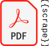

#  Integration

A [HACS](https://www.hacs.xyz/) integration that scrapes text pdf files from the web, a local file, or via upload in the configuration entry process or via a service.  The integration uses combination of regex and [templates](https://www.home-assistant.io/docs/configuration/templating/) it creates sensors that are then updated using polling.

Configuration via Homeassistant UI.

## Requirements

## Installation with HACS

The recommended way to install this is via HACS:

#### Semi-manual install

1. Click on HACS in the Homeassistant side bar
2. Click on the three dots in the upper right-hand corner and select "Custom repositories."
3. In the form enter:

    1. Respository: `iluvdata/pdf_scrape`
    2. Select "Integration" as "Type"

## Manual Installation

Copy the `pdf_scrape` directory to the `custom_components` directory of your Homeassistant Instance.

## Configuration

### Configure a PDF

Add the intergration to Home Assistant:

#### Select PDF source

Pick from the menu one of HTTP/HTTPS, Local, or Upload.

You should be prompted enter a name (optional), url/path/file upload (required), and the polling interval (mininum 30s for HTTP/HTTPS only).  Long intervals for HTTP/HTTPS sources are recommended as pdf files tend to be static and you don't want to be blocked for too frequent of requests or overburden your system with unecessary downloads or updates.

#### Devices and Entities

Each pdf will create a Device that will be listed under "Devices that don't belong to a sub-entry" with a timestamp sensor "Last Modified" containing the date of the last updated of the PDF document.  The source of this data will be contained in an attribute `source_of_date` along with a MD5 checksum (`MD5_checksum`).  The source of this date (listed in priority):
1. PDF Metadata (last modified date)
2. HTTP Server Response Header (`last-modified`)
3. Initial load time if the above were missing
4. Changes in the document MD5 checksum (subsequent updates of the document)

#### Configure additional PDFs

Click "Add Service" in the integration's configuration screen.

### Configure a sensor

Go to the intergation's dashboard.

Click on the three dots to the right of your intergation's entry name.  On the menu click "+ Add Search Target" to start the configuration flow for the search target.  This should be intuitive.

This will create a subentry under the PDF configuration entry for the individual sensor that you've created.

## Upload PDF Service (Uploaded PDF Only)

Updated pdfs can be uploaded via a service specified the following fields:

| Field Name | Description |
|------------|--------------|
| `config_entry_id` | `str` the entry ID of the targeted configuration entry to update.  An integration selector will be shown in the UI|
| `device_id` | `str` of the device ID of the target PDF (if using the UI this will be the target) |
| `file` | File to upload (will have a file selector in the UI).  TODO: create documentation how to do this outside of Home Assistant (via the API).

> [!NOTE]
> Either `config_entry_id` or `device_id` is required in service calls (both can be supplied but at least one is required).